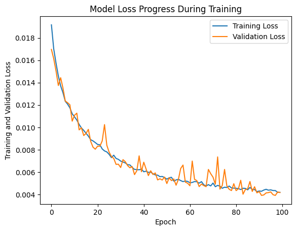
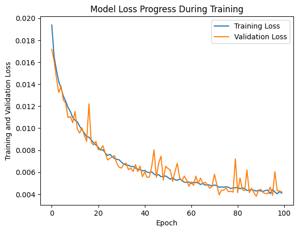

# re-price-predictor

Real Estate Price Prediction Project
This Real Estate Price Prediction project is designed to predict the prices of real estate properties based on various features such as the number of bedrooms, bathrooms, lot size, zip code, and house size. The project is structured into modular components for ease of understanding and maintenance.

## Data
Original dataset: `https://www.kaggle.com/datasets/ahmedshahriarsakib/usa-real-estate-dataset`

1. Only data for the state of Massachussetts was used for training.
2. Columns for previously sold and state were not used
3. Missing values for bed, bath, house_size and acreage were filled in with the first mode value
4. Rows with the top and bottom 25th percentile of outliers for each column were removed

MA only data: `realtor_ma_only.csv`

## Project Structure
The project is divided into the following modules:

- `dataloader.py`: Handles data loading, cleaning, and preprocessing.
- `featurescaling.py`: Scales the features and target variable for neural network input.
- `predictor.py`: Builds and trains the neural network model for price prediction.
- `evaluator.py`: Evaluates the model's performance and visualizes the prediction results.
- `main.py`: Loads datafile for processing, selects features for training and scaling, creates the model,  evaluates the performance and plots the evaluation

## Iterative Improvements and Their Impact
### Initial Setup
In the exploratory state, using Colab notebooks tried various performance improvements. 

- The initial optimizer used was the Adam optimizer
- The five input features were bed, bath, acreage, zipcode and house_size

- The model used has an input layer of  100 neurons, 3 hidden layers of 100, 100 and 200 neurons all useing the ReLU (Rectified Linear Unit) activation function. The final output layer has a single linear activation function.
```
            model = Sequential([
                        Dense(100, input_dim=5, activation='relu'),  # Input layer with 5 inputs
                        Dense(100, activation='relu'),  # Hidden layer
                        Dense(100, activation='relu'),  # Hidden layer
                        Dense(200, activation='relu'),  # Hidden layer
                        Dense(1, activation='linear')  # Output layer for predicting a continuous value
```
#### Results:
- `RMSE` = 124816.16 
- `MSE` = 15579073709.679752 
- `MAE` = 79025.3324009364 
- `R2` = 0.8918900279599247 
- `Adjusted R2` = 0.8918728075120049



While the higher R2 suggests the model is effective,  the absolute error metrics (RMSE, MSE, MAE) are large, giving us room for improvement. 
            
### Improvement 1: Gradient Clipping for Adam optimizer
Added clipping for the Adam optimizer, setting the clipvalue to 0.5 in order to prevent the model's gradients from growing too large and achieving smoother training and more stable convergence.

#### Results:
- `RMSE` = 122652.968 
- `MSE` = 15043750519.464321 
- `MAE` = 77944.16190759506 
- `R2` = 0.8959362635873276 
- `Adjusted R2` = 0.8959196876497021



Improvement in the metrics so tried a other ideas

### Improvement 2: Expanding the Model
Expanded the model's architecture by adding a fourth hidden layer of 200 neurons to see if it improved performance without overfitting the data. 

#### Results:
- `RMSE` = 116160.824 
- `MSE` = 13493337133.553907 
- `MA`E = 71245.49577912228 
- `R2` = 0.9071932068691727 
- `Adjusted R2` = 0.9071784240094832


Adding the 4th hidden layer had an impact, further improving R2 and decreasing the error metrics.


### Improvement 3: Dynamic Learning Rate
Implemented a learning rate scheduler that started with a higher learning rate of .001 which stayed constant for the first 50 epochs and then expoentially lowered allowing the model to fine-tune its weights with more precision. 

#### Results:
- `RMSE` = 89007.439 
- `MSE` = 7922324235.318464 
- `MAE` = 42253.78487972941 
- `R2` = 0.9455342138231086 
- `Adjusted R2` = 0.945525538164272


###Conclusion

Each of the modifications had imporved performance with the addition of the Learning Rate scheduler seemingly causing the biggest jump in performance and the smoothest curve with the a final R2 of .94. A good stopping point. A larger dataset and more features could definitely improve the performance of this model.


# Setup Instructions
To run this project, you will need Python 3.6 or later. It is recommended to use a virtual environment for installing the dependencies.

### Clone the repository to your local machine:
```
bash
```
### Copy code
```
[git clone https://your-repository-url.git](https://github.com/Vino927/re-price-predictor.git)
```

### Install the required dependencies:
```
pip install -r requirements.txt
```

### Running the Project
To generate a specific fractal, run the `main.py` script with Python:
```
python main.py
```

## Usage
To use the project, you must follow these steps sequentially:

- Data Preprocessing: Load and preprocess your dataset using DataPreprocessor.
- Feature Scaling: Scale your features and target variable with FeatureScaler.
- Model Training: Train the real estate price prediction model using RealEstatePricePredictor.
- Model Evaluation: Evaluate the model's performance and visualize the results using ModelEvaluator.


## License
This project is licensed under the GNU General Public License (GPL) v3.0. The GPL is a free, copyleft license that allows software to be freely used, modified, and shared under the same terms. GPL v3.0 further strengthens this approach by ensuring that all derived works are also distributed under the GPL, protecting the software's freedom and the rights of users of GPL-licensed code.

For more details, see the full GPL license text here: [GPL v3.0 License](https://www.gnu.org/licenses/gpl-3.0.html).

